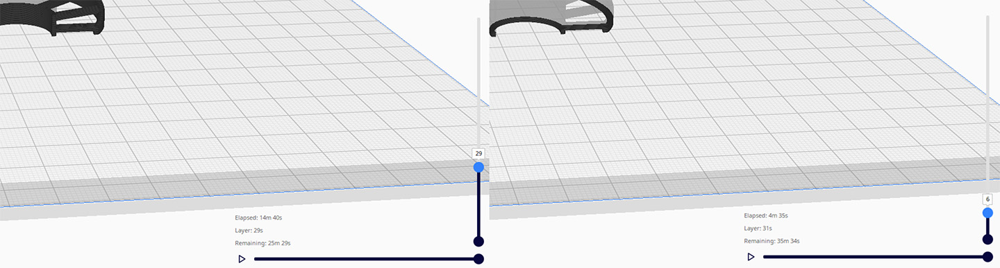

# Layer Timing Info Plugin for UltiMaker Cura

A lightweight standalone extension plugin for UltiMaker Cura (Cura 5.x) that displays a HUD overlay during the **Preview Stage** linked directly to the layer slider.

---

## Features

- **3-Row Real-Time HUD Overlay:**
  - **Elapsed:** Cumulative print time up to the active layer.
  - **Layer:** Print duration of the currently viewed layer.
  - **Remaining:** Estimated remaining print time from the active layer to the end of the print.
- **Dynamic Time Formatting:** Units formatted cleanly without leading zeros (e.g. `45s`, `1m 5s`, `1h`, `1h 1m 5s`, `1d 2h 30m`).
- **100% Standalone:** No modifications to Cura's core code or Uranium binaries required.

---

## Installation

### Method 1: Drag & Drop (Recommended)
1. Download `LayerTimingPlugin.curapackage`.
2. Drag and drop the `.curapackage` file directly into the Cura application window.
3. Restart Cura when prompted.

### Method 2: Direct Folder Copy 
1. Download or extract the `LayerTimingPlugin` folder.
2. Copy the `LayerTimingPlugin` folder into your Cura plugins directory:
   - **Windows:** `%APPDATA%\cura\<version>\plugins\LayerTimingPlugin`  
     *(e.g., `C:\Users\<username>\AppData\Roaming\cura\5.10\plugins\LayerTimingPlugin`)*
   - **macOS:** `~/Library/Application Support/cura/<version>/plugins/LayerTimingPlugin`
   - **Linux:** `~/.local/share/cura/<version>/plugins/LayerTimingPlugin`
3. Restart UltiMaker Cura.

---

## Compatibility

- **UltiMaker Cura:** 5.0.0 and above (API 8 / SDK 8.x)
- **Platforms:** Windows, macOS, Linux

---

## License

GNU Lesser General Public License v3.0 (LGPLv3)
